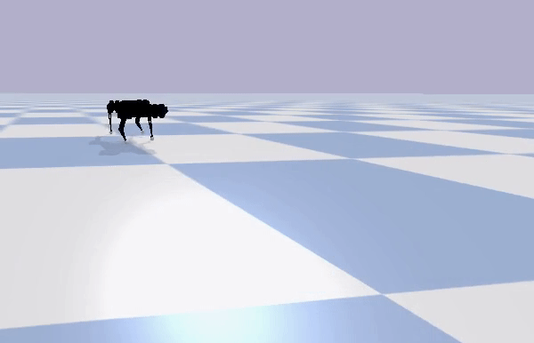
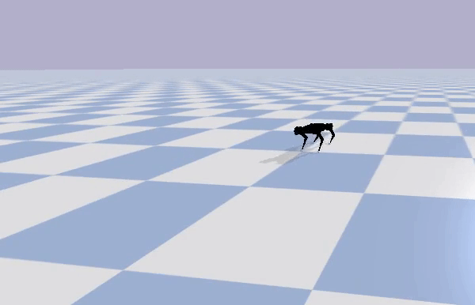

## Gym Environment for MIT Mini Cheetah
### Introduction

   
   

This package consists of a customized gym environment for MIT Mini Cheetah created using PyBullet. It currently supports Stable Baselines 3 and Augmented Random Search (ARS) to train Reinforcement Learning (RL) agents for locomotion on flat terrain. A few pretrained RL agents with tuned hyperparameters are demonstrated.

### Getting Started:
To install the package and its dependencies run the following command, inside the folder, MiniCheetahRL:        
                
        pip install -e .

The code base was tested with gym (0.17.1), PyBullet (3.0.4) with a python version of 3.6.9. However, it is expected to support any future versions of these packages, though they haven't been tested.

### Verify Gym Environment :
        
        cd gym_mini_cheetah
        python3 makeEnv.py
It will output "successfully created" message upon correct installation.

### Overview
#### Environment Name : mini_cheetah-v0

| Parameter    |Dimension | Details| Normalized| Note |
|:------------:|:--------:|:------:|:------:|:--------:|
| Action Space  | 4 | [ FR_Hip_Motor_Pos, FR_Knee_Motor_Pos, BR_Hip_Motor_Pos, BR_Knee_Motor_Pos ]| Yes [-1, 1] | Diagonally opposite legs have same motor positions.|
| Observation Space | 8 | [ robot_z_pos, lin_vel_x, lin_vel_y, lin_vel_z, ang_vel_x, ang_vel_y, roll, pitch ] | No | None |
| Reward | 1 | Summation of gaussian rewards for zero roll target, zero pitch target and desired height. In addition, delta of displacement along X | No | A penality is added if the robot remains standstill|
| Episode Length | 800 Steps|

### Test Pretrained Agents :
#### 1. PPO
        
        cd gym_mini_cheetah/agents/PPO/
        python3 test_PPO.py

#### 2. ARS
        
        cd gym_mini_cheetah/agents/ARS/
        python3 test_ARS.py

### Train Agents :
#### 1. PPO
        
        cd gym_mini_cheetah/agents/PPO/
        python3 train_PPO.py

#### 2. ARS
        
        cd gym_mini_cheetah/agents/ARS/
        python3 train_ARS.py --env_name mini_cheetah-v0

The above command starts the training in the default settings of arguments. However, the following arguments can also be customized in the training as desired by the user.

| Parameter     |About        |  type |
|:-------------:|:-------------:| -----:|
|--policy      | initial polciy to start the training with|str|
| --logdir | Directory root to log policy files (npy)     |str |
| --lr | learning rate     |float |
| --noise | amount of random noise to be added to the weights|float |
| --n_envs | number of parallel agents | int | 
|--episode_length|Horizon of a episode|int |
| --directions | division factor deciding best directions out of N | int|
| --msg |any message acompanying the training|str |

To re-train with tuned hyperparameters, run following command,

        source trainCommand.txt

        
